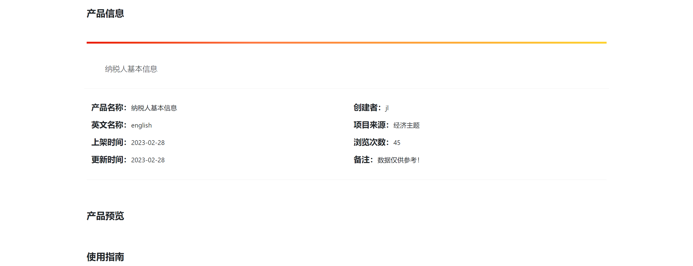

## 数字特区问题修改

####  2023年5月22日~2023年5月24日同步更新数据中台数据；

   - 数据处理：将数据中台提供的数据进行拆分并截图上传至数字特区平台（已解决）。
   - 更新前：没有产品预览
   - 
   - 更新后：产品预览可以查看数据字段和字段描述
   - 

####  2023年5月25日修改深化设计方案：

   - 监测单位提出数字特区的深化设计方案内容应与投标文件的内容相对于，系统功能截图应先体现出投标文件的内容（已按照要求修改并提交）

####  2023年5月26日修改我的空间分页问题;

   - 问题描述：之前的分页每页对页码数进行限制，有多少页展示多少页码（已解决）。
     - 修改前：
     - 

     - 修改后：
     - 

####  2023年5月29日：
   - 我的空间、市场界面、定制商店的分页样式（已修改）；
   - 市场商品列表样式（已修改）：
     - 修改前：
     - 
     - 修改后：
     - 
   - 我的空间->基本信息->认证状态没内容问题（已解决）：
     - 修改前：
     - 修改后：
   - 我的空间->基本信息->个人信息：点击编辑修改信息并提交，刷新页面后信息并未修改（未修改，需要后端人员进行修改）。
     - 

- 管理系统：

  - 申请过后申请人数和次数不会发送变化（未修改，需要后端人员进行修改）

  - 商品申请排行：商品申请后，商品申请排行数据没有（未修改，需要后端人员进行修改）

  - 商品情况分析：商品情况分析没数据（未修改，需要后端人员进行修改）
  - 跳转特区门户，跳转特区门户的链接不对：
    - 
    - 

#### 2023年5月30日：

1. 我的应用分页样式以及功能修改（已修改）
2. 商品详情界面->申请表单：增加表单验证。（已修改）
3. 智能中台数据上架有问题（未修改）

#### 2023年5月31日：

1. 总集提出需要合并管理员手册和用户手册为系统使用手册（已修改）
2. 合并手册发现用户手册和管理员手册的内容都是改版之前的，内容需要调整到最新版本（未修改）
